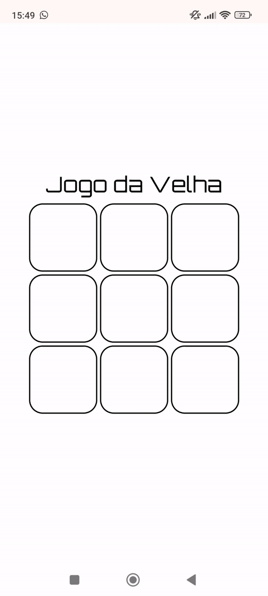

# Jogo da Velha

- Decidi criar esse projeto pensando em praticar conceitos que venho aprendendo no curso web dev fullstack.

- Deixei espaço para algumas implementações, como:  
  Mostrar quem venceu;  
  Botão para resetar (ao invés de atualizar página);  
  Iniciar solicitando o nome dos players, entre outros.  

## Objetivo do Projeto 🎯

- Fins de estudo e documentação do meu desenvolvimento pessoal;
- Fixar conceitos;
- Treinar "boas maneiras/práticas" na programação.

## Tecnologias Utilizadas 💻

- HTML 5
- CSS 3
- JS

## Demo 📷

  

